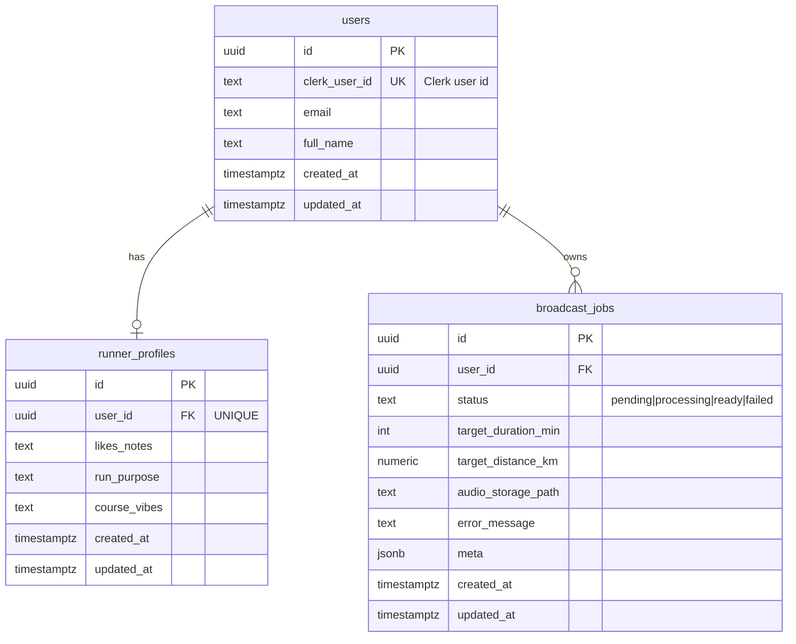

# データベース設計 — RUNdio

## 1. ER図

## 2. テーブル定義

### 2.1 `public.users`

Clerk と同期するアプリユーザー。マイグレーション `20250203_init_users.sql` 参照。

### 2.2 `public.runner_profiles`

| カラム | 型 | NULL | 説明 |
|--------|-----|------|------|
| id | uuid | NO | PK |
| user_id | uuid | NO | FK users(id) ON DELETE CASCADE, UNIQUE |
| likes_notes | text | YES | 好み・好物 |
| run_purpose | text | YES | 走る目的 |
| course_vibes | text | YES | コースのイメージ |
| created_at | timestamptz | NO | 作成 |
| updated_at | timestamptz | NO | 更新 |

### 2.3 `public.broadcast_jobs`

| カラム | 型 | NULL | 説明 |
|--------|-----|------|------|
| id | uuid | NO | PK |
| user_id | uuid | NO | FK users(id) |
| status | text | NO | ジョブ状態 |
| target_duration_min | int | YES | 目標時間（分） |
| target_distance_km | numeric(8,2) | YES | 距離目標時 |
| audio_storage_path | text | YES | 公開パス or ストレージキー |
| error_message | text | YES | 失敗時 |
| meta | jsonb | YES | デモフラグ等 |
| created_at | timestamptz | NO | |
| updated_at | timestamptz | NO | |

## 3. インデックス

- `idx_users_clerk_user_id`
- `idx_runner_profiles_user_id`
- `idx_broadcast_jobs_user_id`, `idx_broadcast_jobs_status`

## 4. RLS

新テーブルは RLS 有効。**アプリは service_role 経由**でアクセスする想定（Clerk JWT を Supabase に載せない構成）。
