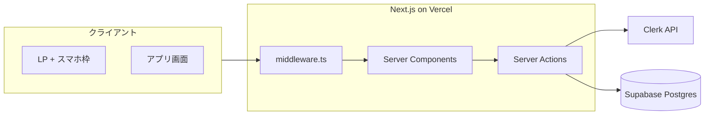
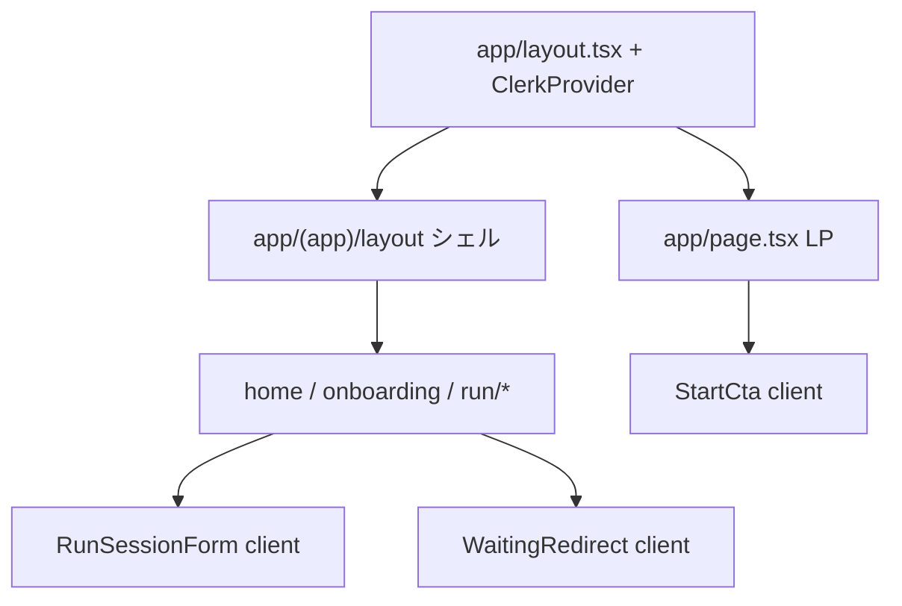

# システムアーキテクチャ — RUNdio

## 1. 目的

Next.js（App Router）を中心に、**Clerk** と **Supabase** を組み合わせ、モバイル最適化 Web と社内デモ用 LP を同一アプリで提供する構成を定義する。

## 2. 技術スタック

| 層 | 技術 | 選定理由 |
|----|------|----------|
| UI | Next.js 15 App Router, React 19, Tailwind CSS v4 | RSC/Server Actions、講義・実装の整合 |
| 認証 | Clerk | Hosted UI、セッション管理、既存マイグレーション |
| データ | Supabase PostgreSQL | `users` / `runner_profiles` / `broadcast_jobs` |
| 配信 | Vercel（想定） | Next との統合 |

## 3. アーキテクチャ概要図

## 4. 認証・データフロー

1. ユーザーが Clerk でサインイン。
2. 保護ルートで `ensureSupabaseUser()` が `users` を upsert。
3. Server Action が **service role** の Supabase クライアントで `runner_profiles` / `broadcast_jobs` を更新（RLS はクライアント直叩きを想定しない）。

## 5. コンポーネント階層

## 6. Server / Client 方針

| 種別 | 例 | 理由 |
|------|-----|------|
| Server | `home/page.tsx`, `play/page.tsx`, `onboarding/page.tsx` | DB 読み取り、認可チェック |
| Client | `RunSessionForm`, `WaitingRedirect`, `StartCta` | フォームモード、タイマー、Clerk SignedIn |

## 7. 将来拡張

- **Supabase Storage** に音声ファイル保存、署名付き URL で再生。
- **バックグラウンドジョブ**（Vercel Cron / QStash 等）で `processing` → `ready` 遷移。
- **Route Handlers** でジョブポーリング API を公開。
