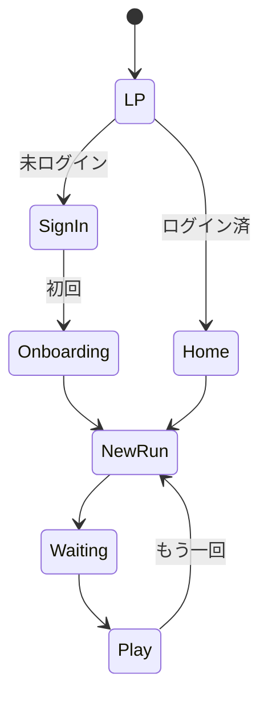

# UI/UX 設計 — RUNdio

## 1. デザインコンセプト

- **テーマ**: ダーク UI、**シアン**アクセント、ランナー向けの落ち着きと前向きさ。
- **情報密度**: モバイルでは**1画面1目的**。LP のみやや情報多め（デモ枠）。
- **音声中心**: 再生画面はコントロールを大きく、説明文は最小限。

## 2. デザイントークン（目安）

| トークン | 値 |
|----------|-----|
| 背景 | `#0c0c0f` 〜 zinc-950 |
| サーフェス | zinc-900, border zinc-800 |
| テキスト主 | zinc-50〜100 |
| テキスト副 | zinc-400〜500 |
| アクセント | cyan-400〜500 |
| 角丸（ボタン） | rounded-xl 〜 full |
| タップ領域 | 最低 44px 相当 |

## 3. タイポグラフィ

- 日本語可読性優先。**Noto Sans JP** をスタックに含める（`globals.css`）。
- 見出し: `font-semibold`, `tracking-tight`
- キャプション: `text-xs text-zinc-500`

## 4. 画面一覧と役割

| 画面 | 役割 |
|------|------|
| LP | 価値提案、StartCta、スマホ枠デモ |
| サインイン | Clerk 埋め込み |
| ホーム | セッション開始への導線 |
| オンボーディング | 3 フィールドの自己紹介 |
| セッション新規 | 時間/距離モード |
| 待機 | 準備中の期待感 |
| 再生 | 音声 + 再実行 |

## 5. 画面遷移図

## 6. 主要ワイヤー（コンポーネント配置）

### LP

- ヘッダー: ブランド + ヒーロー H1 + リード文
- CTA 行: `StartCta` | アンカーリンク「デモを見る」
- セクション: H2 + スマホ枠（iframe 390px 幅）

### セッション新規（RunSessionForm）

- hidden `mode`
- ラジオ 2 つ（時間 / 距離）
- 条件付き数値入力 1 系統
- プライマリボタン 1 つ

### 再生

- H1 + メタ行（分/km）
- `audio.w-full`
- セカンダリ: もう一回 / ホーム

## 7. アクセシビリティ

- フォームに `<label>` 関連付け
- iframe に `title`
- エラーは色だけに依存しない（文言併記）

## 8. レスポンシブ

- **モバイルファースト**: 単カラム max-w-lg（アプリシェル）
- LP: `max-w-6xl`、デモ枠は中央寄せ
