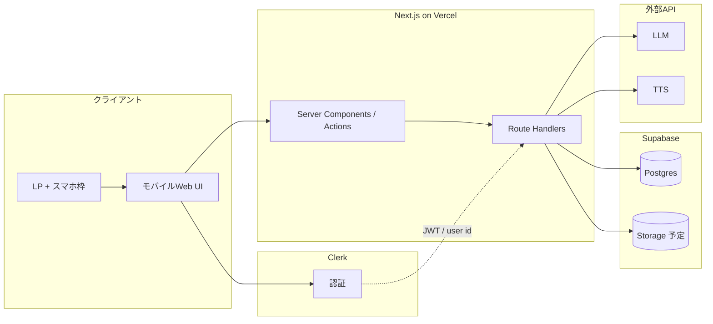

# アーキテクチャ — RUNdio

## 1. 論理構成

---

## 2. データの流れ（放送生成）

1. ユーザーが **目標時間/距離** と嗜好を送信。
2. **API** が `broadcast_jobs` レコードを作成（`pending`）。
3. **ワーカーまたは同一API内の非同期処理**（MVPは同期でも可だが長尺は非同期推奨）が:
   - LLM で**台本・セグメント**を生成
   - TTS で**音声チャンク**を生成し結合（または一括）
4. 成果物を **Storage** に保存し、**再生用URL** をジョブに紐づけ。
5. クライアントが **ステータスをポーリング**し、`ready` になったら再生。

---

## 3. 主要テーブル（概要）

| テーブル | 役割 |
|----------|------|
| `users` | Clerk 連携ユーザ（既存マイグレーション） |
| `runner_profiles` | 嗜好・走る目的・コースのイメージ等 |
| `broadcast_jobs` | 生成ジョブとステータス、音声パス、エラー |

詳細は `demo-implementation/supabase/migrations/` を参照。

---

## 4. デプロイ形態（目標）

- **同一Nextアプリ**が LP とアプリUIの両方を提供（パス分け: `/` = LP、`/app` = ログイン後UI 等）。

---

## 5. 未実装（次スプリント）

- Route Handler による実ジョブ実行。
- Storage バケットポリシー。
- 本番相当のキュー（必要なら Inngest / QStash 等）。
