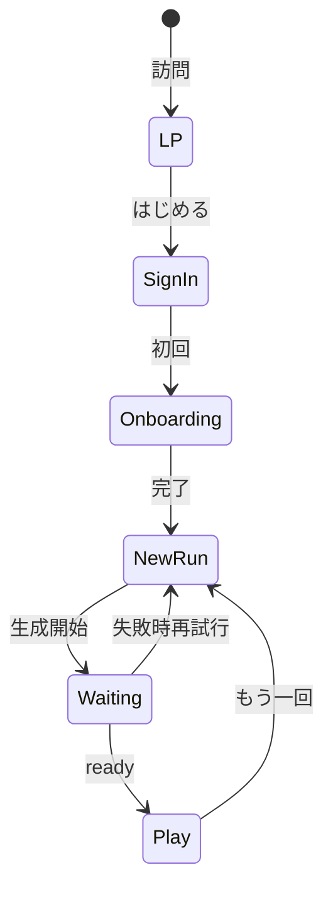

# ユーザーフロー — RUNdio

## 1. 画面とルートの対応

| # | 画面 | パス案 |
|---|------|--------|
| S0 | ランディング | `/` |
| S1 | サインイン／サインアップ | `/sign-in`, `/sign-up` |
| S2 | オンボーディング | `/onboarding` |
| S3 | セッション作成 | `/run/new` |
| S4 | 生成待ち | `/run/[id]/waiting` |
| S5 | 再生 | `/run/[id]/play` |
| S6 | 履歴（任意） | `/runs` |

MVP 必須: **S0〜S5**。

---

## 2. オンボーディング〜初回再生（メインフロー）

### 2.1 新規ユーザー

1. **LP（S0）** を開く。コンセプトを読み、「はじめる」で **サインアップ（S1）**。
2. アカウント作成後、**オンボーディング（S2）** へ。
3. **好み・走る目的・コースのイメージ**を短文で入力し保存。
4. **セッション作成（S3）** で **目標時間 または 距離** を入力し「生成開始」。
5. **生成待ち（S4）** で進捗／目安を表示。完了すると **再生（S5）** へ誘導。
6. **再生（S5）** で音声を聴く。終了後、「もう一回」で **S3** に戻る。

### 2.2 リピートユーザー（オンボーディング済み）

1. **サインイン（S1）** → **S3**（またはホーム経由で S3）。
2. 以降は 2.1 の **手順 4〜6** と同じ。

---

## 3. LP 内デモ（プレゼン用）

1. 視聴者は **PC** で **S0** を開く。
2. ページ内の **スマホ枠**（iframe 等）に **埋め込みデモ** を表示（現状は `/demo` プレースホルダー可）。
3. 本番では枠内でも **S3〜S5** と同等の操作ができることを目指す。

---

## 4. 例外・エッジ

| 状況 | 望ましい挙動 |
|------|----------------|
| 生成失敗 | **S4** でエラー表示、**再試行**または**時間を短くして再生成**を提案。 |
| 長時間生成 | **S4** で**目安時間**と**キャンセル**（任意）。 |
| 未ログインで保護ページ | **S1** へリダイレクト。 |

---

## 5. 遷移図（MVP）

---

## 6. iOS Safari 向け注意

- **自動再生**: ユーザーの**タップ後**に再生開始する設計に合わせる。
- **バックグラウンド**: MVP は**フォアグラウンド主**でも可。PWA 化する場合は別途検証。

---

## 7. プレゼン用デモシナリオ（約3分）

1. LP と**スマホ枠**を見せる。
2. ログイン済み想定で **目標30分** → **生成開始**。
3. **待機画面**（短時間デモなら事前生成済みに切替可）。
4. 音声**冒頭数十秒**を再生し品質を見せる。
5. **サーバー生成・マルチユーザー**に一言触れる。
