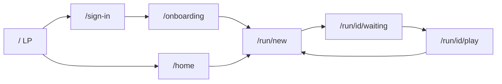
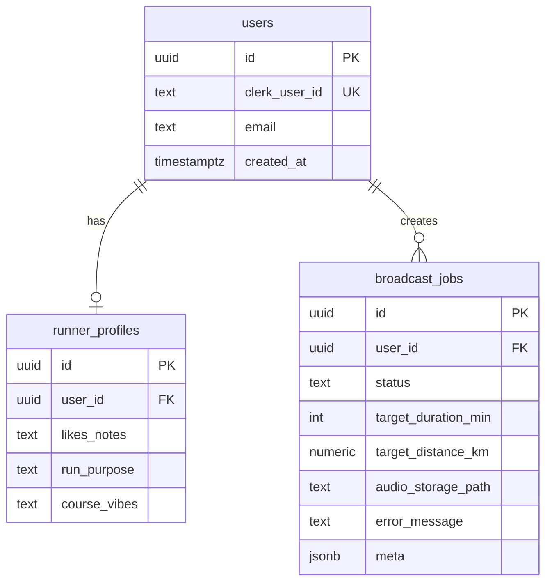
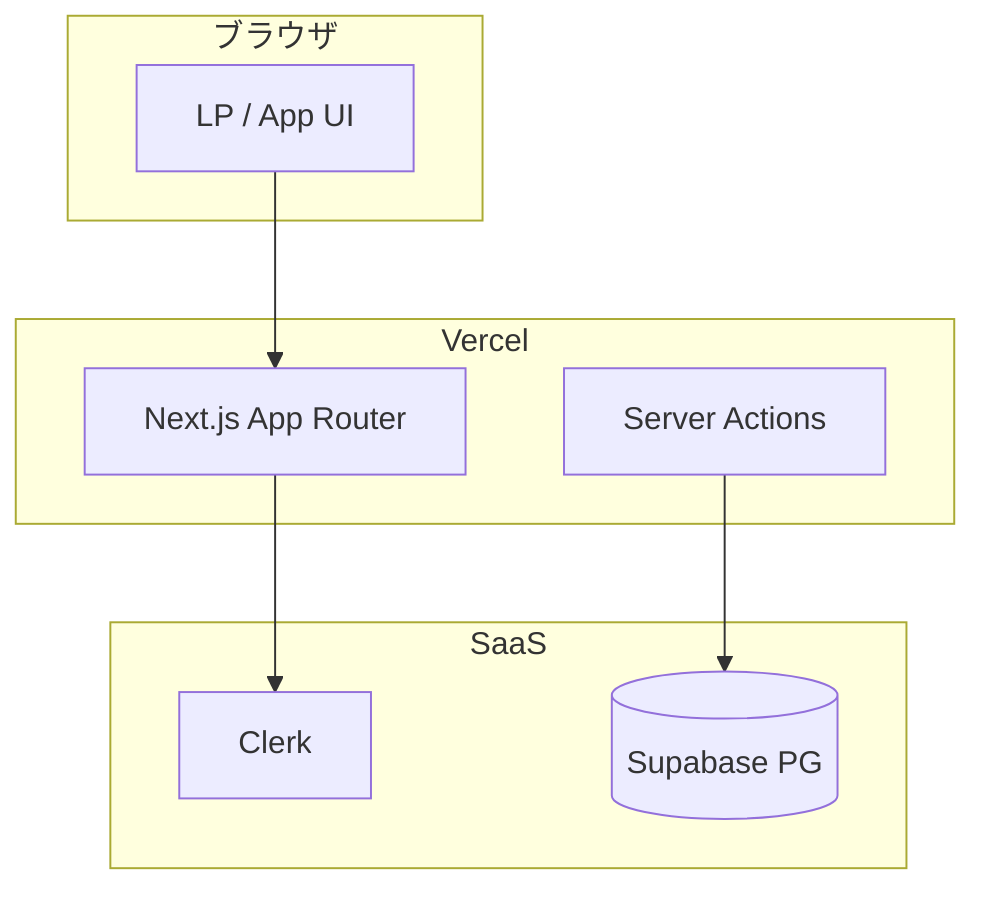
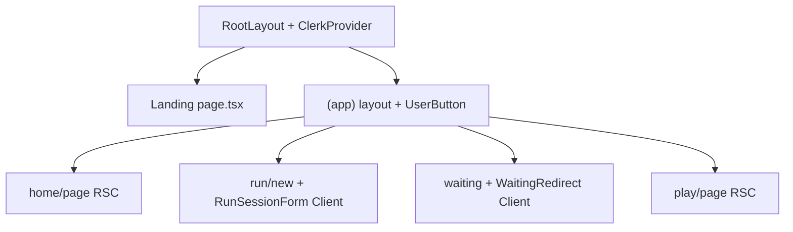

# 要件定義書（詳細）— RUNdio

**入力**: `docs/output/system_requirements.md`, `docs/input/*`  
**版**: 2026-04-06

---

## 1. プロジェクト概要

### 1.1 プロジェクト名

**RUNdio**（社内プレゼン向け MVP／プロトタイプ）

### 1.2 背景・目的

- **背景**: ソロランの単調さ、汎用オーディオでは満たしにくい「走りに寄り添う音声」への需要。
- **目的**: 社内数名による実利用と PC プレゼンで、**UX を主軸**に価値を示す。収益化は当面対象外。

### 1.3 システムのビジョン / スコープ

- **ビジョン**: 走る前に、**自分の好みと今日の目標**に合わせたラジオ体験が用意される。
- **スコープ（含む）**: モバイル Web、Clerk 認証、プロフィール、セッション作成、ジョブ記録、再生、LP・スマホ枠デモ、日本語 UI。
- **スコープ（含まない）**: 週次番組表、Garmin/NRC 連携、ネイティブストアアプリ、課金、本番の完全自動長尺生成（デモは固定音声可）。

---

## 2. ビジネス要件

### 2.1 ビジネスモデル情報（任意）

| リーンキャンバス要素 | 内容 |
|----------------------|------|
| 課題 | ソロランのマンネリ、選択肢の単調さ |
| 価値提案 | パーソナルな「走る前ラジオ」 |
| チャネル | 社内 URL（Vercel 等想定） |
| 収益 | 当面なし（社内提案） |

**7 Powers**: 本フェーズでは**差別化（体験の独自性）**をデモで示すことが主。スケール・ネットワークは将来。

**市場数値**: 本ドキュメントでは数値目標を置かない（社内デモ）。

### 2.2 成果指標（KPI/KGI）

| 指標 | 目標（定性） |
|------|----------------|
| デモ成功率 | 当日、**6 アカウント**でオンボーディング〜再生まで通る |
| UX 評価 | 技術聴衆が「プロトタイプ以上」と感じる UI・音声 |
| 説明可能性 | マルチユーザー・サーバー処理を**補足**で説明できる |

### 2.3 ビジネス上の制約

- 社内ネットワーク・SaaS 利用ポリシーに従う。
- 外部 LLM/TTS はコスト・キー管理が必要（本番フェーズ）。

---

## 3. ユーザー要件

### 3.1 ユーザープロファイル / ペルソナ

- **メイン**: 会社員ランナー、Garmin + スマホオーディオ利用、ソロラン、iOS 会社端末。
- **課題**: マンネリ、「もっと走るとどんな放送が聞けるか」への期待。

### 3.2 ユーザーストーリー

1. **ランナーとして**、好みと目的を保存したい。**なぜなら**放送のトーンを自分向けにしたいから。
2. **ランナーとして**、今日の**時間または距離目標**を入れたい。**なぜなら**その長さに合う放送を聞きたいから。
3. **ランナーとして**、走る前に準備が整うまで待ちたい。**なぜなら**走行中に途切れたくないから。
4. **ランナーとして**、自然な音声で聞きたい。**なぜなら**没入感が欲しいから。
5. **視聴者として**、LP のスマホ枠で操作を追いたい。**なぜなら**システム理解したいから。

### 3.3 MVP（Minimum Viable Product）の定義

- **範囲**: 認証、オンボーディング、セッション作成、待機演出、再生、LP・枠、固定デモ音声。
- **ゴール**: 社内プレゼンで**通しで見せられる**こと。

---

## 4. 機能要件

### 4.1 機能一覧 / MoSCoW 分類

| 機能 ID | 機能名 | 要約 | Must/Should/Could/Won't | MVP 対象 |
|---------|--------|------|-------------------------|----------|
| F-001 | 認証 | Clerk サインアップ／イン／アウト | Must | Yes |
| F-002 | ユーザー同期 | Clerk → Supabase `users` | Must | Yes |
| F-003 | オンボーディング | runner_profiles 登録 | Must | Yes |
| F-004 | セッション作成 | 時間 or 距離、ジョブ作成 | Must | Yes |
| F-005 | 待機 UI | 生成中の演出／将来はポーリング | Must | Yes |
| F-006 | 再生 | 音声ファイル再生 | Must | Yes |
| F-007 | LP | コンセプト・CTA・スマホ枠 | Must | Yes |
| F-008 | 実生成パイプライン | LLM+TTS+Storage | Should | No（後続） |
| F-009 | 週次番組 | UI・ロジック | Won't | No |
| F-010 | ウェアラブル連携 | Garmin 等 | Won't | No |

### 4.2 機能詳細仕様

#### 4.2.1 F-003 オンボーディング

- **概要**: 嗜好・走る目的・コースイメージを `runner_profiles` に保存する。
- **ユースケース**: 初回ログイン後、プロフィール未作成のユーザー。
- **前提**: `users` 行が存在する（Clerk 同期済み）。
- **正常系**: フォーム送信 → upsert → `/run/new` へリダイレクト。
- **例外系**: DB エラー時はエラーメッセージ（日本語）。
- **UI**: ラベル付き textarea、送信ボタン、ダークテーマ。
- **非機能**: 入力は XSS エスケープ、サーバー側バリデーション（長さ上限 (仮定) 2000 文字）。

#### 4.2.2 F-004 セッション作成（放送ジョブ）

- **概要**: 時間モードまたは距離モードで `broadcast_jobs` を作成。
- **距離モード**: `target_distance_km` を保存し、`target_duration_min = round(km * 6)`（6 分/km）。
- **時間モード**: `target_duration_min` のみ（距離は null）。
- **デモ**: `status=ready`, `audio_storage_path=/demo-audio/demo.mp3`, `meta.demo=true` (仮定実装)。
- **例外系**: 未認証は `/sign-in`、プロフィール未作成は `/onboarding`。

#### 4.2.3 F-006 再生

- **概要**: ジョブ ID に紐づく音声を、**所有者のみ**が再生可能。
- **正常系**: `broadcast_jobs` と `users.clerk_user_id` を突合し、`<audio controls>` で再生。
- **例外系**: 他人の ID は 404。ファイル未配置時は文言で案内。

---

## 5. UI/UX設計

### 5.1 デザインコンセプト

- **カラー**: 背景 zinc-950、本文 zinc-50〜100、アクセント cyan-400〜500。
- **タイポ**: システム UI フォント + Noto Sans JP（読みやすさ）。
- **コンポーネント**: 角丸 xl〜2xl、主要 CTA はシアン塗り。

### 5.2 画面一覧

| ID | 画面 | パス |
|----|------|------|
| S0 | LP | `/` |
| S0b | 埋め込みデモ | `/demo` |
| S1 | サインイン／アップ | `/sign-in`, `/sign-up` |
| S2 | ホーム | `/home` |
| S3 | オンボーディング | `/onboarding` |
| S4 | セッション新規 | `/run/new` |
| S5 | 待機 | `/run/[id]/waiting` |
| S6 | 再生 | `/run/[id]/play` |

### 5.3 画面遷移図（Mermaid）

### 5.4 ワイヤーフレーム（テキスト）

**LP**: 上部ブランド「RUNdio」、見出し、短い説明、**はじめる**（StartCta）と**デモへ**アンカー、下にスマホ枠（iframe）。

**セッション新規**: 見出し「セッション」、ラジオで時間/距離、単一の数値入力、送信「放送を準備する」。

**再生**: 見出し「再生」、目標要約テキスト、フル幅 `audio`、二次「もう一回」。

---

## 6. 非機能要件

### 6.1 パフォーマンス

- 主要画面表示 **3 秒以内**（体感、6 ユーザー想定）。

### 6.2 セキュリティ

- Clerk セッション、**サービスロールキーはサーバーのみ**、HTTPS。

### 6.3 可用性・信頼性

- デモ用 **mp3 をリポジトリ外で配布**する手順を README に記載。

### 6.4 ユーザビリティ / A11y

- ラベル・ボタン名は日本語、キーボード操作可能なフォーム、音声コントロールはネイティブ。

### 6.5 スケーラビリティ

- MVP は単一リージョンで可。アクセス増は Vercel／Supabase のスケールに委譲。

---

## 7. データベース設計

### 7.1 ER図（Mermaid）

### 7.2 テーブル定義（主要）

**users**（既存マイグレーション）

| カラム | 型 | 制約 |
|--------|-----|------|
| id | uuid | PK, default gen_random_uuid() |
| clerk_user_id | text | UNIQUE NOT NULL |
| email | text | NOT NULL |

**runner_profiles**

| カラム | 型 | 備考 |
|--------|-----|------|
| id | uuid | PK |
| user_id | uuid | FK → users.id, UNIQUE |
| likes_notes, run_purpose, course_vibes | text | NULL 可 |

**broadcast_jobs**

| カラム | 型 | 備考 |
|--------|-----|------|
| status | text | pending/processing/ready/failed |
| target_duration_min | int | NULL 可だが運用上は設定 |
| target_distance_km | numeric(8,2) | NULL 可 |
| audio_storage_path | text | 公開 URL パスまたは Storage キー |
| meta | jsonb | デモフラグ等 |

---

## 8. インテグレーション要件

### 8.1 外部サービス

| サービス | 用途 |
|----------|------|
| Clerk | 認証 |
| Supabase | DB（将来 Storage） |
| （将来）OpenAI 等 | 台本 |
| （将来）ElevenLabs 等 | TTS |

### 8.2 API 仕様（REST・論理）

認証: **Clerk セッション Cookie**（ブラウザ）。サーバーは `auth()` で userId 取得。

#### `POST` 論理: プロフィール保存

- Server Action `saveRunnerProfile(FormData)` — HTTP エンドポイント化は任意。

#### `POST` 論理: セッション作成

- Server Action `createBroadcastSession(FormData)` — 成功時 `redirect /run/[id]/waiting`。

#### `GET /api/broadcast-jobs/:id`（将来・任意）

- **Response 200**: `{ id, status, audio_storage_path, target_duration_min }`
- **404**: 存在しない／他人のジョブ

（現リポジトリは Server Action + RSC 中心。）

---

## 9. 技術選定とアーキテクチャ

### 9.1 技術スタックの要約

Next.js 15 App Router, React 19, TypeScript, Tailwind v4, Clerk, Supabase, Vercel（想定）。

### 9.2 アーキテクチャ概要図（Mermaid）

### 9.3 コンポーネント階層図（Mermaid）

### 9.4 主要コンポーネント方針

| コンポーネント | Server/Client | 状態 | Props 例 |
|----------------|---------------|------|----------|
| RunSessionForm | Client | `useState` mode | なし（action 属性で SA） |
| WaitingRedirect | Client | タイマー | なし（useParams） |
| StartCta | Client | — | なし |
| Home/Page 各種 | Server | — | — |

---

## 10. 開発プロセス / スケジュール

| フェーズ | 主なタスク |
|----------|------------|
| 要件・設計 | input/output/design 確定（本書） |
| MVP 実装 | 認証・DB・画面通し・デモ音声 |
| リハ | 6 アカウント・iOS 実機確認 |
| 拡張 | 実生成・Storage・ポーリング |

---

## 11. リスクと課題

| No | リスク | 影響 | 対策 |
|----|--------|------|------|
| R1 | 長尺生成の失敗 | 高 | デモ mp3 固定 |
| R2 | Clerk/Supabase 設定ミス | 中 | .env.example と README |
| R3 | iOS 自動再生 | 中 | ユーザー操作後に play |

### 11.2 課題 / 前提

- 講義用プロンプト4は「認証未実装」を想定しうるが、本プロジェクトは **Clerk 実装済み**（差分は README に記載）。

---

## 12. ランニング費用と運用方針

### 12.1 ランニング費用の目安

- Clerk / Supabase / Vercel: **無料枠**内想定（6 ユーザー・デモ）。
- LLM/TTS: 従量（本番フェーズ）。

### 12.2 運用・保守体制

- 開発者が兼務。**監視**は MVP では最小（手動確認）。

---

## 13. 変更管理

- `docs/input` を正本とし、変更は PR / コミットで追跡。
- `open-decisions.md` で未決を蓄積。

---

## 14. 参考資料 / 関連ドキュメント

- `docs/input/*`
- `docs/output/system_requirements.md`
- `docs/design/*`（プロンプト3の出力）
- `demo-implementation/README.md`
